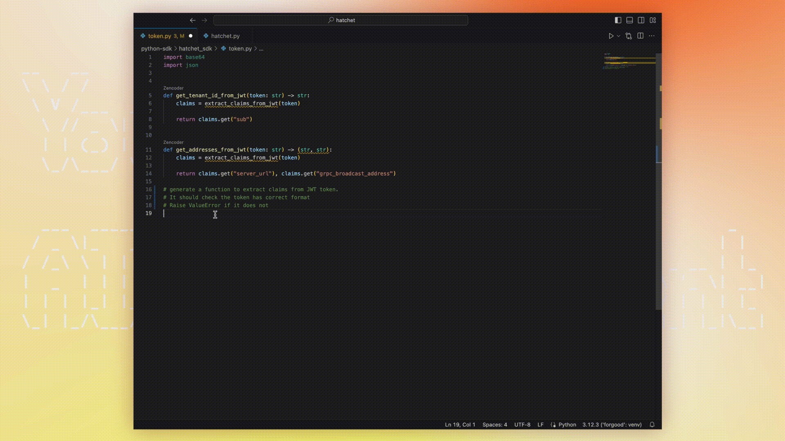
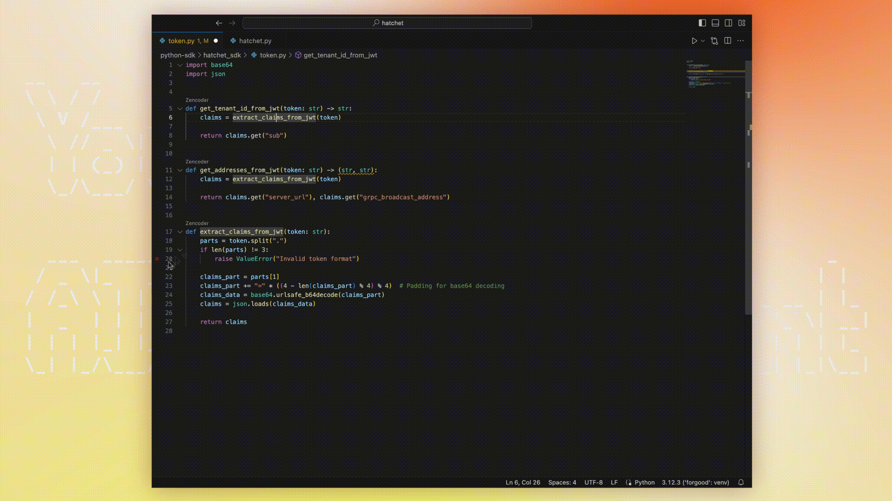
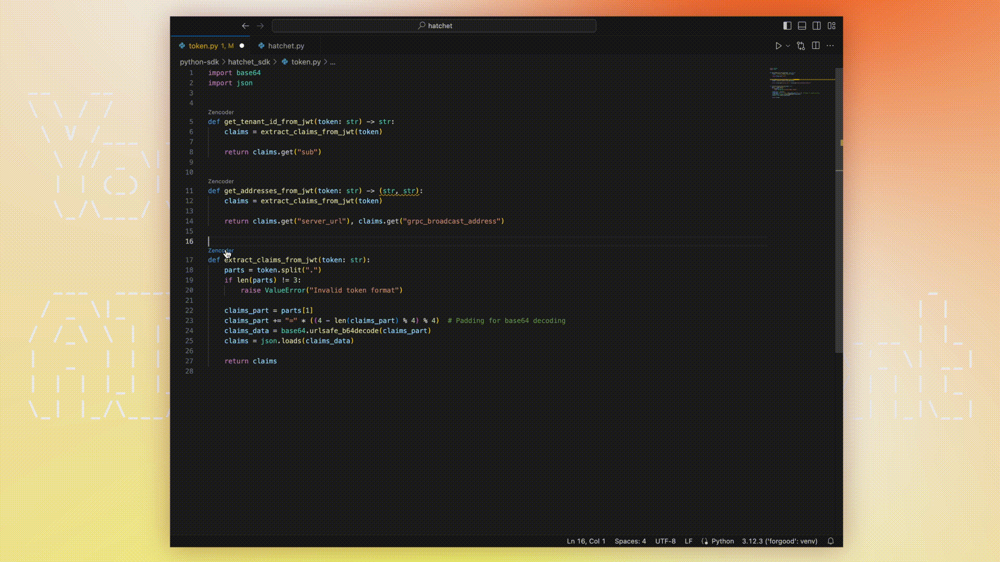
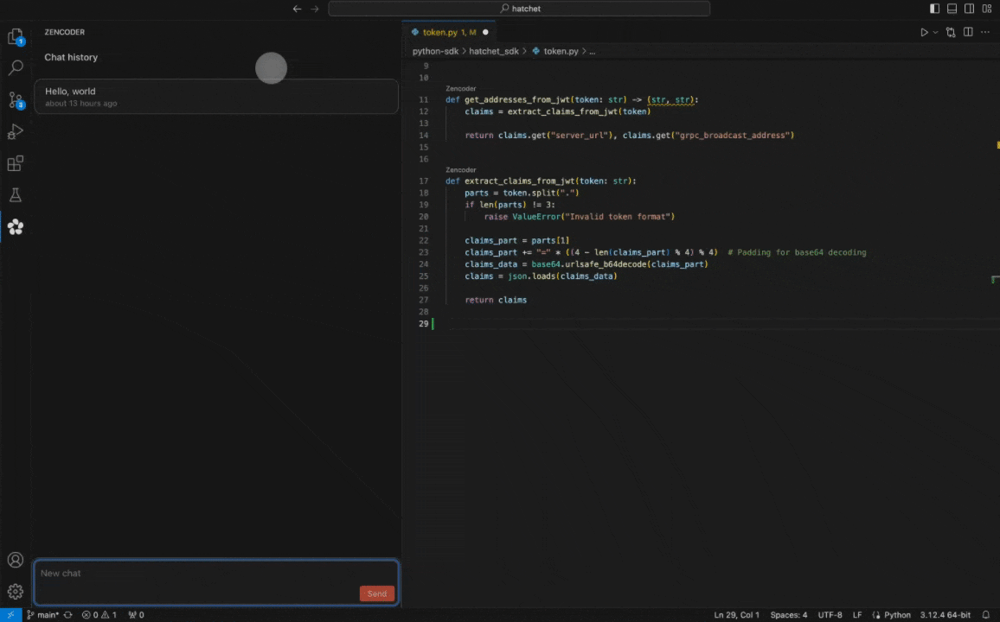

# Zencoder: Your Mindful AI Coding Agent

Zencoder.ai is an AI platform that utilizes embedded AI agents for code generation, unit testing, and docstring creation. It provides precise suggestions by analyzing your code and integrates seamlessly into your workflow. Install Zencoder.ai on VSCode in less than a minute and effortlessly elevate your productivity.

## Unique Approach

Zencoder™ leverages embedded AI agents to enhance code generation, delivering superior quality right from the start. By using syntactic and semantic analysis of your repository and of the generated code, our embedded coding agents iteratively improve the results for you. Seamlessly integrated into your workflow, Zencoder ensures your team consistently produces robust, reliable code, accelerating development. By reducing the amount of routine work, we give you the space to focus on more creative and complex tasks that create value for your organization.

## What Can You Do with Zencoder?

### Code Generation

Zencoder leverages a specialized proprietary AI pipeline for code generation, ensuring that the generated code is usable from the start. This proprietary AI pipeline achieves industry-leading compilation rates, making the development process more efficient. Developers can use natural language to request code generation, automating tedious tasks and enabling them to focus on innovation. This feature not only speeds up development but also enhances overall productivity and faster product delivery.

### Unit Testing

Unit test generation is a critical part of our code generation pipeline, ensuring that the generated code is robust and reliable. By automating unit test creation and execution, Zencoder helps maintain high code quality and reduces the time developers spend on writing tests manually. This automation streamlines the development process, allowing developers to concentrate on creating innovative solutions and improving the overall software quality.

### Docstring Generation

Writing docstrings is often an overlooked but essential task in software development, especially in large codebases. Docstrings play a crucial role in ensuring smooth knowledge transition between team members, particularly new hires. By automating docstring generation, Zencoder allows developers to focus on high-value tasks.

### Chat

Chat with an AI that understands your current file context. Ask questions, request explanations, or seek advice about your code by opening the chat panel and typing your query.

## Installation and Configuration

1. **Open Visual Studio Code**  
   Launch the Visual Studio Code editor on your computer.

3. **Access the Extensions View**  
   Click on the Extensions icon in the Activity Bar on the side of the window. Alternatively, you can open the Extensions view by pressing `Ctrl+Shift+X` (Windows/Linux) or `Cmd+Shift+X` (Mac).

4. **Search for the Zencoder Plugin**  
   In the Extensions view, type “Zencoder” into the search bar at the top.

5. **Install the Zencoder Plugin**  
   Locate the Zencoder plugin in the search results. Click the “Install” button next to the Zencoder plugin. The installation process will begin, and the plugin will be added to your Visual Studio Code setup.

6. **Activate the Zencoder Plugin**  
   After installation, you may be prompted to reload Visual Studio Code to activate the plugin. Click the “Reload” button if prompted.

7. **Configure the Zencoder Plugin**  
   Once the plugin is installed and activated, you might need to configure it with your Zencoder account details. Follow any on-screen instructions to complete the configuration. If prompted, log in with your Zencoder account credentials.

8. **Start Using Zencoder**  
   You can now start using Zencoder’s features directly within Visual Studio Code. Look for the Zencoder icon or commands within the editor to access functionalities such as code generation, unit testing, and docstring generation.

## Support, Feedback, and Community

### Knowledge Base
For detailed guides, troubleshooting articles, and FAQs, visit our [Knowledge Base](https://46014728.hs-sites.com/). It’s designed to help you navigate the features of Zencoder and optimize your usage.

### Community Forum
Connect with other Zencoder users, share experiences, and discuss best practices in our [Community Forum](https://46014728.hs-sites.com/). It’s a great place to learn from others and contribute your insights.

### Feedback
We’d love to get your help in making Zencoder better! If you have feedback or encounter any problems, please reach out on our [Feedback form](https://46014728.hs-sites.com/).

### Helpful Links
- [Discord community](https://discord.gg/YjNYBHg8Vb)
- [Slack Community](https://join.slack.com/t/zencoder-community/shared_invite/zt-2k6o9dts3-JKuYxzJs0J~CFvVa6hIAqA)
- [Zencoder Website](https://zencoder.ai)
- support@zencoder.ai
- [Terms of Service](https://zencoder.ai/terms-of-service)
- [Privacy Policy](https://zencoder.ai/privacy-policy)

## 
We hope you enjoy using Zencoder.ai and experience the future of coding!
